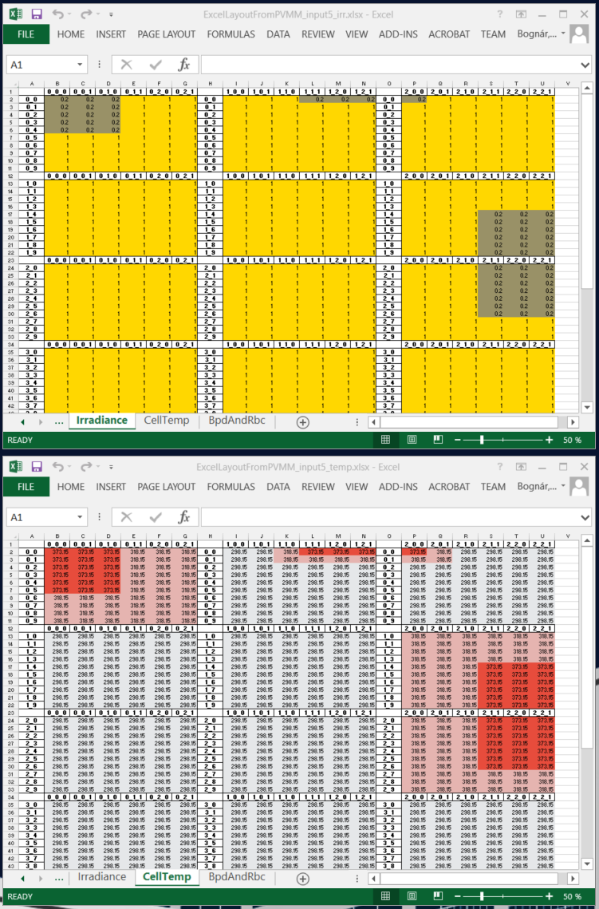
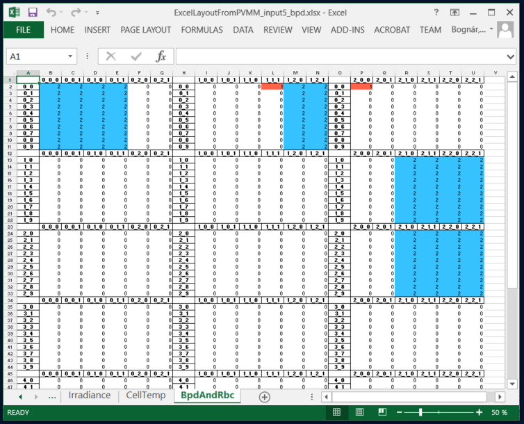
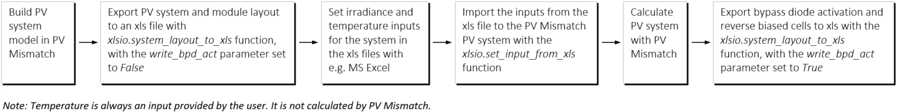

# PVMismatchXLSIO
Excel-Python Irradiance I/O tool for [PVMismatch](https://github.com/SunPower/PVMismatch).

# Features
* Creating a human-readable xls of the PV system layout from a PVMismatch PVsystem object with the PV cell indexes, irradiances and temperatures.
* Reading human-readable irradiance and temperature input from an xls file to PVMismatch.

* Writing human-readable indication of bypass-diode activation and reverse-biased cells (assuming the system operates at MPP). Reverse biased cells are indicated with 1 (red), bypassed cells are indicated with 2 (blue).

# Tutorial
Overview of usage:

See example_workflow.ipynb jupyter notebook in the example_workflow folder.
To start it:

* clone or copy this repository to your computer
* open a terminal window and navigate to the example_workflow folder in the cloned repository
* type: jupyter notebook example_workflow.ipynb

Alternatively, you can open and run (from the same location) the example_workflow.py file.
