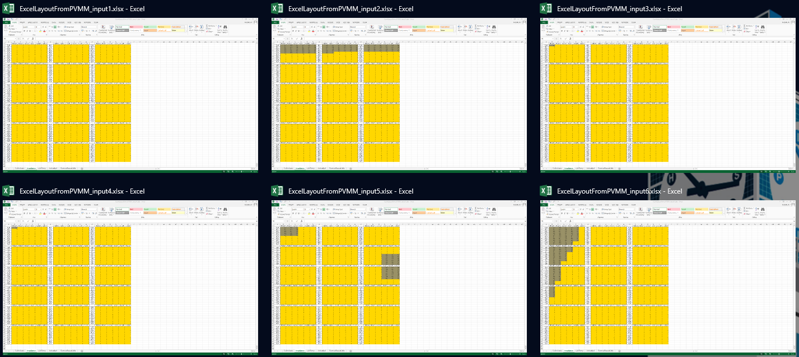

# PVMismatchXLSIO
Excel-Python Irradiance I/O tool for [PVMismatch](https://github.com/SunPower/PVMismatch).

# Features
* Creating a human-readable xls of the PV system layout from a PVMismatch PVsystem object with the PV cell indexes, irradiances and temperatures.
* Reading human-readable irradiance input from an xls file to PVMismatch.

# Tutorial
See example_workflow.ipynb jupyter notebook in the example_workflow folder.
To start it:
* clone or copy this repository to your computer
* open a terminal window and navigate to the example_workflow folder in the cloned repository
* type: jupyter notebook example_workflow.ipynb

Alternatively, you can open and run (from the same location) the example_workflow.py file.
