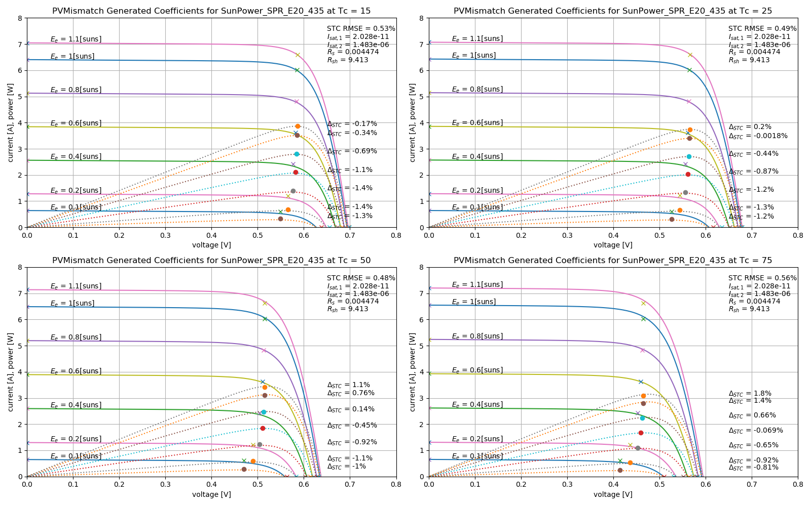

.. _contrib:

Contributions
=============

.. automodule:: pvmismatch.contrib

Generate Coefficients
---------------------

.. automodule:: pvmismatch.contrib.gen_coeffs
   :members:

Example
~~~~~~~
Run the example in :mod:`~pvmismatch.contrib.gen_coeffs`::

    python pvmismatch/contrib/gen_coeffs/example.py STC ./examples

This creates a figure ``examples/STC.png`` which calculates the coefficients
using only STC conditions, and displays the power error relative to STC, and
the RMSE of the IV curve relative to ``IMP0``, ``VMP0``, ``ISC0``, and
``VOC0``.

Run the example again with ``IEC61853`` as the first argument::

    python pvmismatch/contrib/gen_coeffs/example.py IEC61853 ./examples

This creates a figure ``examples/IEC61853.png`` which calculates the
coefficients using the IEC61853 test conditions, and displays the power error
relative to STC, and the RMSE of the IV curve relative to ``IMP0``, ``VMP0``,
``ISC0``, and ``VOC0``.

.. image:: examples/IEC61853.png

Note: You can see that the lack of irradiance correction on shunt resistance
in PVMismatch causes a larger error when the IEC61853 test results are used.

Module Mismatch Simulator
-------------------------

.. automodule:: pvmismatch.contrib.module_mismatch_simulator

