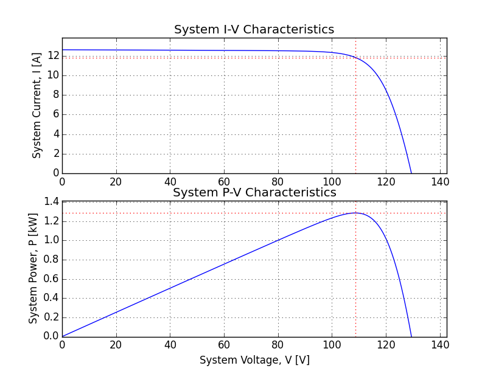

.. _quickstart:

Quickstart
==========
Hopefully this tutorial can get you up and running fast.

Requirements
------------
Most packages can be found at PyPI, but for Windows-x64 some are only available
at `Unofficial Windows Binaries for Python Extension Packages by Christoph Gohlke <http://www.lfd.uci.edu/~gohlke/pythonlibs/>`_.

* `NumPy <http://www.numpy.org/>`_ - for 64-bit get
  `NumPy-MKL by Christoph Gohlke <http://www.lfd.uci.edu/~gohlke/pythonlibs/#numpy>`_
* `SciPy <http://www.scipy.org/>`_ - for 64-bit get
  `SciPy for NumPy-MKL by Christoph Gohlke <http://www.lfd.uci.edu/~gohlke/pythonlibs/#scipy>`_
* `matplotlib <http://matplotlib.org/>`_

Optional
^^^^^^^^
The following packages are optional.

* `Sphinx <http://sphinx-doc.org/>`_ - required to build documentation
* `graphvix <http://graphviz.org/>`_ - required for diagrams in docs
* `pillow <https://python-pillow.github.io/>`_ - required to run tk application
* `nose <https://nose.readthedocs.org/en/latest/#>`_ - required to run tests

Installation
------------
After downloading PVMismatch, install it with `pip <https://pip.pypa.io/en/stable/>`_::

    $ pip install pvmismatch-2.0-py2-none-any.whl

Example
=======
In this example let's make a PV system of 2 strings with 8 modules each using
standard 96 cell modules. You can enter these commands in the Python
interpreter, run them from a script or simply paste them in
`IPython <http://ipython.org/>`_ with ``%paste``.

.. code-block:: python

   >>> from pvmismatch import *  # this imports everything we need
   >>> pvsys = pvsystem.PVsystem(numberStrs=2, numberMods=8)  # makes the system
   >>> from matplotlib import pyplot as plt  # now lets make some plots
   >>> plt.ion()  # this turns on interactive plotting
   >>> f = pvsys.plotSys()  # creates a figure with the system IV & PV curve

